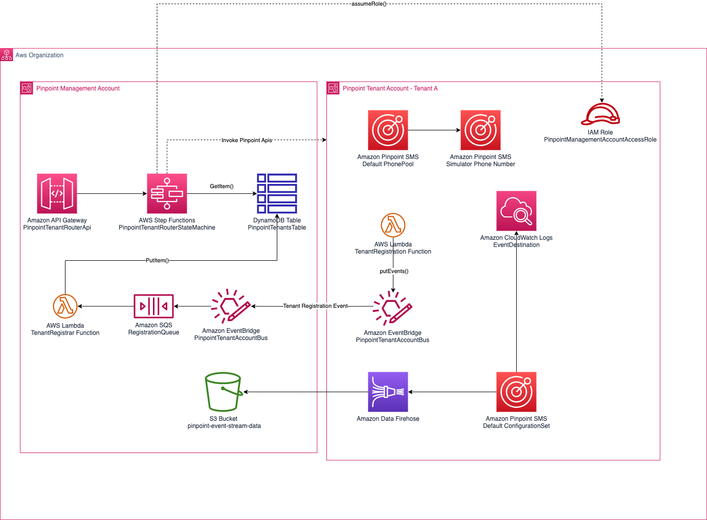
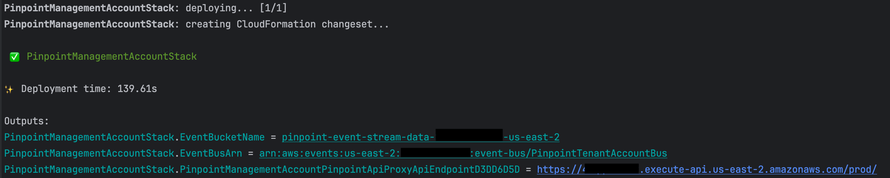
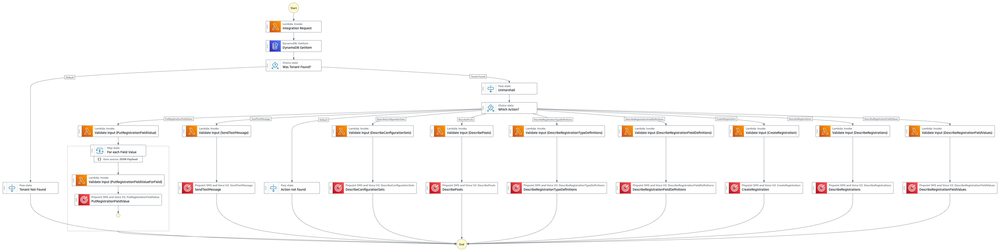

# multiple-accounts-multiple-amazon-pinpoint-projects

This AWS CDK project is an example implementation of the "Multiple Accounts &
Multi Pinpoint Projects (MA/MP)"
architecture described in
the ["How to implement multi-tenancy with Amazon Pinpoint"](https://aws.amazon.com/blogs/messaging-and-targeting/how-to-implement-multi-tenancy-with-amazon-pinpoint/)
blog post by Tristan Nguyen.

# Architecture

The project consists of two stacks.

## PinpointManagementAccountStack

This stack should be deployed once into an AWS account within an AWS Organization. This account will be designated as the Pinpoint Management Account (PMA) and will serve as the central location from which Pinpoint APIs in Pinpoint Tenant Accounts (PTA) can be invoked.

This stack deploys an Amazon API Gateway Rest API called PinpointTenantRouterApi. The API is backed by an Express AWS Step Functions state machine called PinpointTenantRouterStateMachine. This state machine routes cross-account Pinpoint API requests to the correct tenant account by looking up the AWS account ID from the PinpointTenantsTable DynamoDB table based on the "tenantId" path variable in the HTTP request. The state machine then assumes the PinpointManagementAccountAccessRole role deployed in each of the tenant accounts.

This stack also deploys an S3 bucket called `pinpoint-event-stream-data-${Aws.ACCOUNT_ID}-${Aws.REGION}` for centrally aggregating all Pinpoint event data from tenant accounts.

When a PinpointTenantAccountStack is deployed, it registers itself with the PMA via a cross-account EventBridge event. The Registrar Lambda function in the Management account then records the tenant information in the PinpointTenantsTable and also updates the bucket policy to allow the Amazon Data Firehose in the tenant account to write events

## PinpointTenantAccountStack

This stack can be deployed in multiple AWS accounts. It deploys the PinpointManagementAccountAccessRole which allows cross-account Pinpoint API calls to be made from the management account. It also deploys a default PhonePool, ConfigurationSet, and registers a simulator PhoneNumber in the pool.

The ConfigurationSet is deployed with two event destinations configured - a CloudWatch LogGroup and an Amazon Kinesis Data Firehose delivery stream.

When the stack is deployed, it registers itself with the management account using a Lambda function called TenantRegistration. This Lambda function puts a tenant registration event on the default EventBridge event bus containing the tenant name, AWS account ID, region, and the ARN of the IAM Role used by the Firehose delivery stream. An EventBridge rule forwards the event to the PinpointTenantAccountBus in the management account (see above for details).

⚠️ **Notice** ⚠️ - Be aware the **PinpointManagementAccountAccessRole** deployed by this stack 
grants  `sms-voice:*` and `mobiletargeting:*`  permissions to callers from  management account by design.

# Build and Deploy

### Install dependencies

`npm install`

### Bootstrap CDK environment

Please ensure the AWS accounts being used have been CDK [bootstrapped](https://docs.aws.amazon.com/cdk/v2/guide/bootstrapping.html).

### Deploy the management account stack

Deploy the PinpointManagementAccountStack to the management account first.
The stack accepts the following [CDK context values](https://docs.aws.amazon.com/cdk/v2/guide/context.html)

* **organizationId** - The AWS Organization Id. Can be found by calling ` aws organizations describe-organization`.  *[Required]*
* **apiTempPassword** - If specified an 'admin' user will be added to the Cognito User pool with this temporary password. The password must be at least 9 characters long, include digits, both lower and  uppercase letters as well as symbols.  *[Optional]*
* **apiHostName** -  The subdomain name of the Pinpoint Management Acccount API endpoint. *[Optional]*
* **parentHostedZoneId** - If **apiHostName** is specified you must specify a the parent hosted zone specify the parent hosted zone id.  *[Optional]*
* **parentHostedZoneName** - If the parent hosted zone specified by the **parentHostedZoneId** parameter is in the same AWS account you're deploying to, you must specify the parent hosted zone name. *[Optional]*
* **crossAccountZoneDelegationRoleArn** - If the parent hosted zone specified by the **parentHostedZoneId** parameter is in another AWS account, specify the cross account role ARN that has access to register a subdomain with the hosted zone in that account.  *[Optional]*
* **apiStageName** - The API stage name.  *[Optional]*

`npm run deploy -- -c stack=PinpointManagementAccountStack -c organizationId=<YOUR_AWS_ORGANIZATION_ID> -c apiTempPassword=<API_TEMP_PASSWORD> <OTHER_PARAMETERS_DESCRIBED_ABOVE>` <-- *Requires AWS account credentials to be present on the console*

After the stack deploys successfully the following output variables will be displayed

* **PinpointManagementAccountStack.EventBucketName** - The S3 bucket name where Pinpoint Events will be aggregated
* **PinpointManagementAccountStack.EventBusArn** - The EventBridge EventBus ARN tenant accounts should register with
* **PinpointManagementAccountStack.PinpointManagementAccountPinpointApiProxyApiEndpoint** - The Pinpoint Management Account API endpoint

### Deploy the tenant account stack

One the PinpointManagementAccountStack is deployed you can deploy multiple Pinpoint Tenant Accounts using the command below.
The stack accepts the following [CDK context values](https://docs.aws.amazon.com/cdk/v2/guide/context.html)

*  **tenantId** - The identifying name of the tenant.  *[Required]*
* **managementAccountId** - The AWS Account Id you deployed the PinpointManagementAccountStack to.  *[Required]*
* **eventStreamingBucketName** - The value from the PinpointManagementAccountStack.EventBucketName output.  *[Required]*
* **targetEventBusArn** - The value from the PinpointManagementAccountStack.EventBusArn output.  *[Required]*

`npm run deploy -- -c stack=PinpointTenantAccountStack -c tenantId=<PINPOINT_TENANT_NAME> -c managementAccountId=<PINPOINT_MANAGEMENT_ACCOUNT_ID> -c eventStreamingBucketName=<PinpointManagementAccountStack.EventBucketName> -c targetEventBusArn=<PinpointManagementAccountStack.EventBusArn>` <-- *Requires AWS account credentials to be present on the console*

### Invoke the API
Once the PinpointManagementAccountStack and at least one PinpointTenantAccountStack is deployed you will be able to trigger a few example Pinpoint API calls on the tenant account via the management account API.

The endpoint url accepts the POST method only. The url has the following format:

`https://<PinpointManagementAccountStack.PinpointManagementAccountPinpointApiProxyApiEndpoint>/<tenantId>/<action>`

* **PinpointManagementAccountStack.PinpointManagementAccountPinpointApiProxyApiEndpoint** - The Pinpoint Management Account API endpoint
* **tenantId** - The identifying name of the tenant
* **action** - The [Amazon Pinpoint SMS and Voice v2 API](https://docs.aws.amazon.com/pinpoint/latest/apireference_smsvoicev2/API_Operations.html) operations
  * The following actions are supported by the example
    * [SendTextMessage](https://docs.aws.amazon.com/pinpoint/latest/apireference_smsvoicev2/API_SendTextMessage.html)
    * [DescribeConfigurationSets](https://docs.aws.amazon.com/pinpoint/latest/apireference_smsvoicev2/API_DescribeConfigurationSets.html)
    * [DescribePools](https://docs.aws.amazon.com/pinpoint/latest/apireference_smsvoicev2/API_DescribePools.html)
    * [PutRegistrationFieldValue](https://docs.aws.amazon.com/pinpoint/latest/apireference_smsvoicev2/API_PutRegistrationFieldValue.html)
    * [DescribeRegistrationTypeDefinitions](https://docs.aws.amazon.com/pinpoint/latest/apireference_smsvoicev2/API_DescribeRegistrationTypeDefinitions.html)
    * [DescribeRegistrationFieldDefinitions](https://docs.aws.amazon.com/pinpoint/latest/apireference_smsvoicev2/API_DescribeRegistrationFieldDefinitions.html)
    * [CreateRegistration](https://docs.aws.amazon.com/pinpoint/latest/apireference_smsvoicev2/API_CreateRegistration.html)
    * [DescribeRegistrations](https://docs.aws.amazon.com/pinpoint/latest/apireference_smsvoicev2/API_DescribeRegistrations.html)
    * [DescribeRegistrationFieldValues](https://docs.aws.amazon.com/pinpoint/latest/apireference_smsvoicev2/API_DescribeRegistrationFieldValues.html)

    
The payload of the request should be the parameters of the operation. 

More operations can be added by modifying the [TenantRouterStateMachine.asl.json](src/infrastructure/state-machines/TenantRouterStateMachine.asl.json) file.

### Cleanup
To clean update resource you can either delete the CloudFormation stacks via the AWS console or call the cdk destroy functions. 

⚠️ **Warning** - The following resources in the Pinpoint Management Account must be **manually** deleted

* **pinpoint-event-stream-data-*** S3 buckets 
* **PinpointTenantsTable** DynamoDB table
